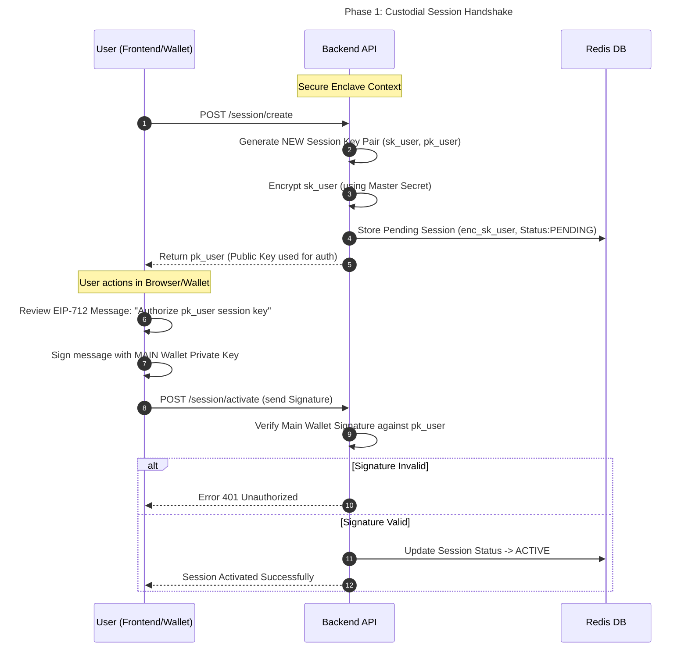
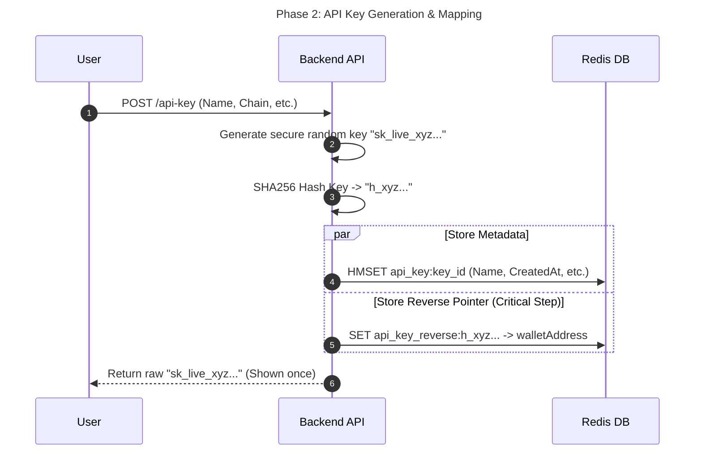
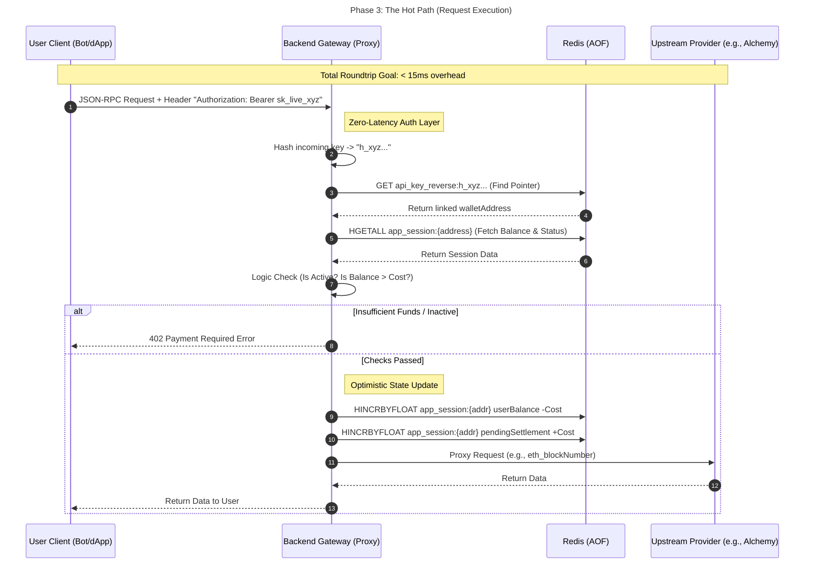
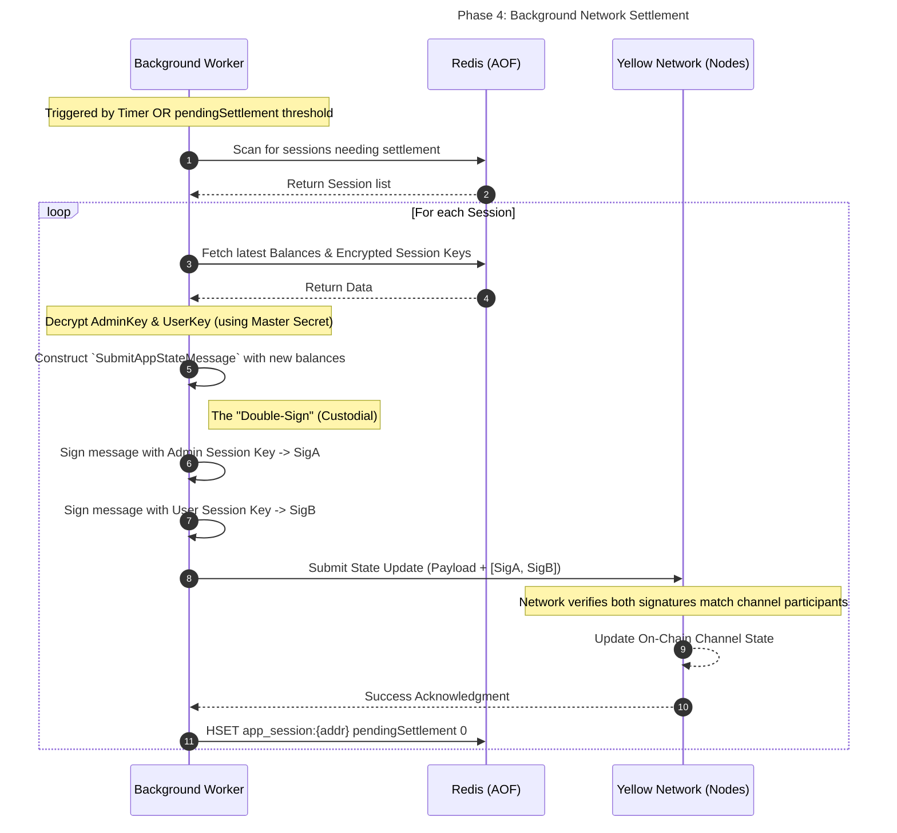

# Yellow RPC

YellowRPC is a payment gateway designed specifically for high-frequency APIs. It enables a true "Pay-Per-Request" model with near zero-latency settlement, bridging the gap between static Web3 payments (x402) and the real-time needs of the machine economy.

The existing x402 (Payment Required) standard for crypto is impractical for high-performance applications because:

1. Paying gas fees for every single API call is economically unviable.
2. Standard on-chain payments require waiting for block confirmations (2–12 seconds).

Instead of broadcasting a transaction for every request, the user opens a secure State Channel with the gateway.

1. For every API request, the user's client cryptographically signs a "micro-balance update" (e.g., "I pay 0.0001 USDC").
2. Our proxy verifies this signature and performs all buisness logic in <20ms, granting immediate access to the API.
3. Hundreds of these micro-transactions are aggregated into a state transition inside the state channel.

## Flow

### Phase 1: The Handshake (Session Creation)

Unlike standard dApps that require a wallet signature for every action, we use a Custodial Session Key model. This allows our backend to auto-sign settlements on the user's behalf without interrupting their workflow.

1. Request: The user requests a new session via `/session/create`.
2. Key Generation: The Backend generates a brand new Session Key Pair (`sk_user`, `pk_user`) inside a secure enclave.
3. Authorization: The Backend sends the `pk_user` (Public Key) to the frontend.
4. Signing: The user signs a standardized EIP-712 message with their main wallet: "I authorize this Session Key to act on my behalf."
5. Activation: The signed message is sent to `/session/activate`. The backend verifies the signature and marks the session as `ACTIVE` in Redis.

### Phase 2: The Keys (API Management)

Once a session is active, the user creates API Keys. These keys are pointers to the App Session.

- Endpoint: `/api-key/create`
- Action: The backend generates a standard key (e.g., yellow_rpc_cdkas...).
- Mapping: This key is hashed and stored in Redis with a direct reference to the `app_session`. Multiple API keys point to the same session, allowing for unified billing across different user devices.

### Phase 3: The Hot Path (Request Execution)

This is the high-performance loop where latency matters most. We use an Optimistic Debit model.

1. Lookup: The Gateway hashes the incoming API Key and retrieves the associated AppSession from Redis (Sub-millisecond).
2. Logic Check:
   - Is the session ACTIVE?
   - Is the user's balance sufficient to execute the request?
3. Optimistic Update: The backend immediately deducts the cost from the Redis balance (HINCRBYFLOAT).
4. Proxy: The request is forwarded to the upstream provider (e.g., Alchemy/Infura).
5. Response: The data is returned to the user.

Note: At this stage, no data is sent to the Yellow Network. The debt is tracked locally in `pendingSettlements`.

### Phase 4: The Pulse (Network Settlement)

To ensure trustlessness, we periodically sync the local Redis state with the global Yellow Network.

- Trigger: Occurs periodically (e.g., every 5 minutes) OR when `pendingSettlements > $1.00`.
- The Double-Sign:
  1. The Worker retrieves the latest balance from Redis.
  2. It constructs a SubmitAppStateMessage.
  3. It signs the message using the Admin's Session Key.
  4. It signs the message again using the stored User's Session Key (created in Phase 1).
- Broadcast: This "Double-Signed" state update is submitted to the Yellow Network nodes. The network verifies both signatures and updates the channel state immutably.

